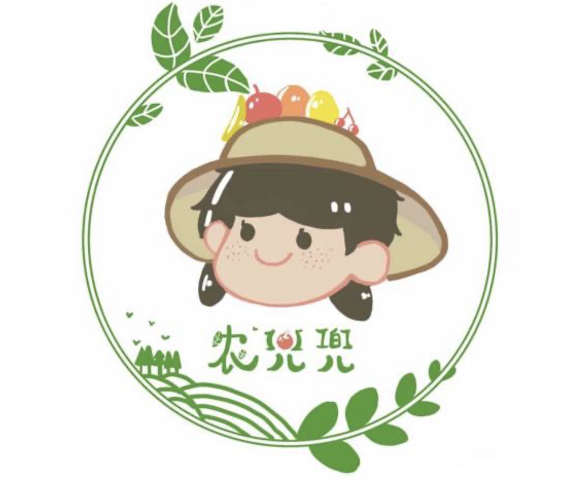
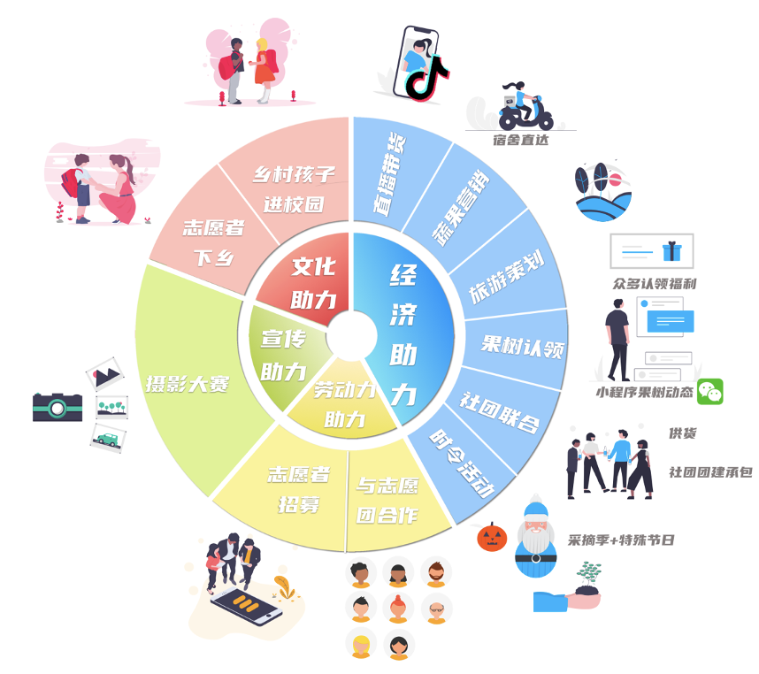
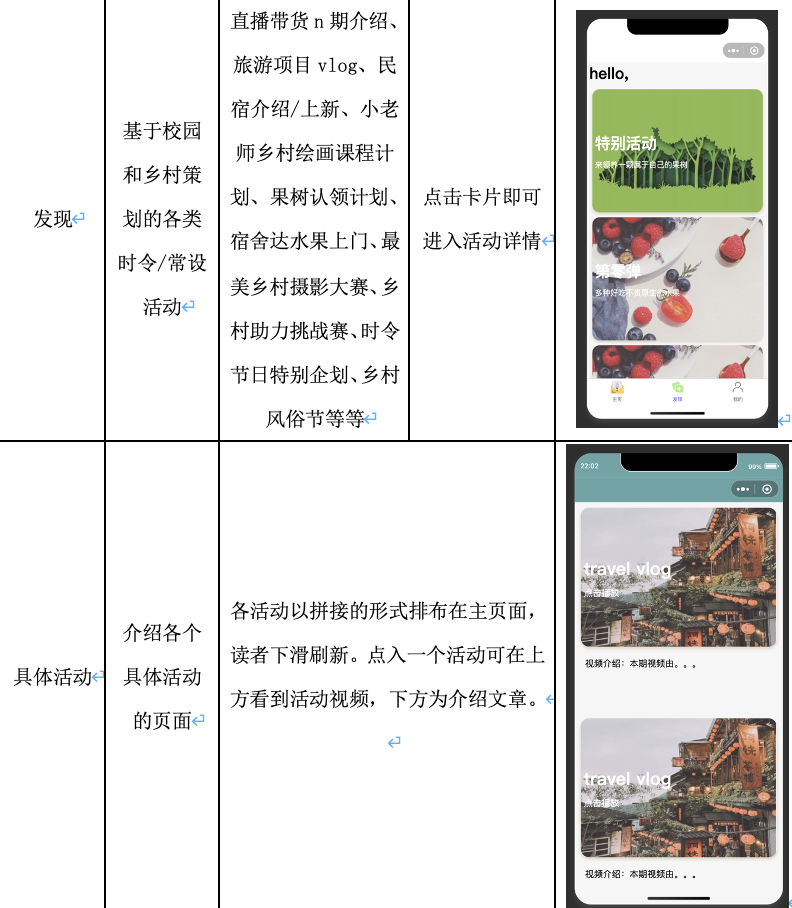
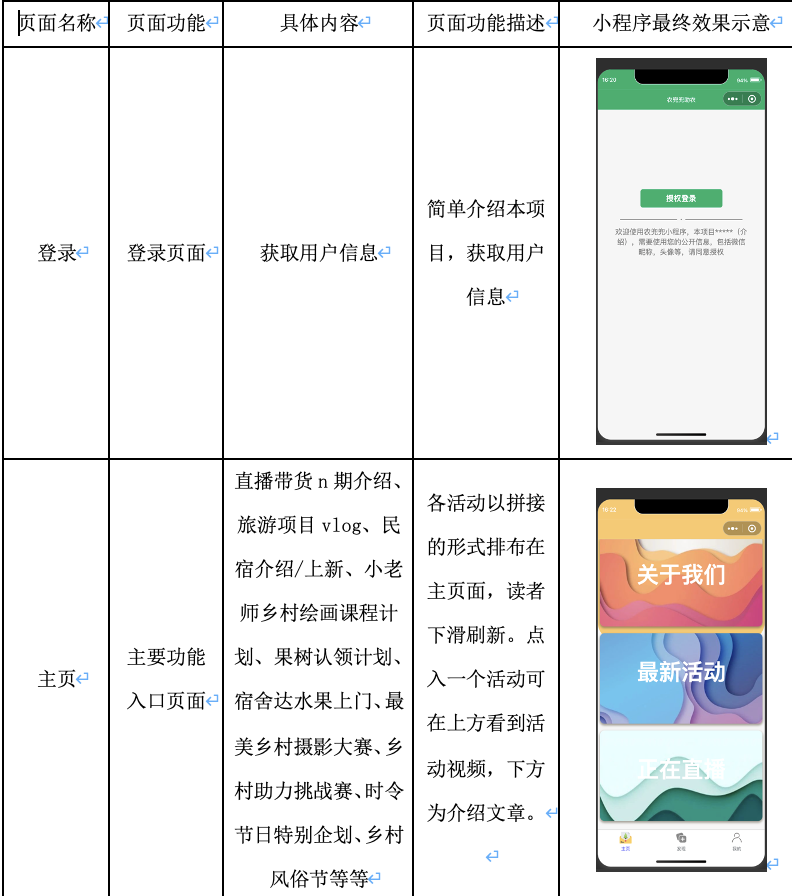
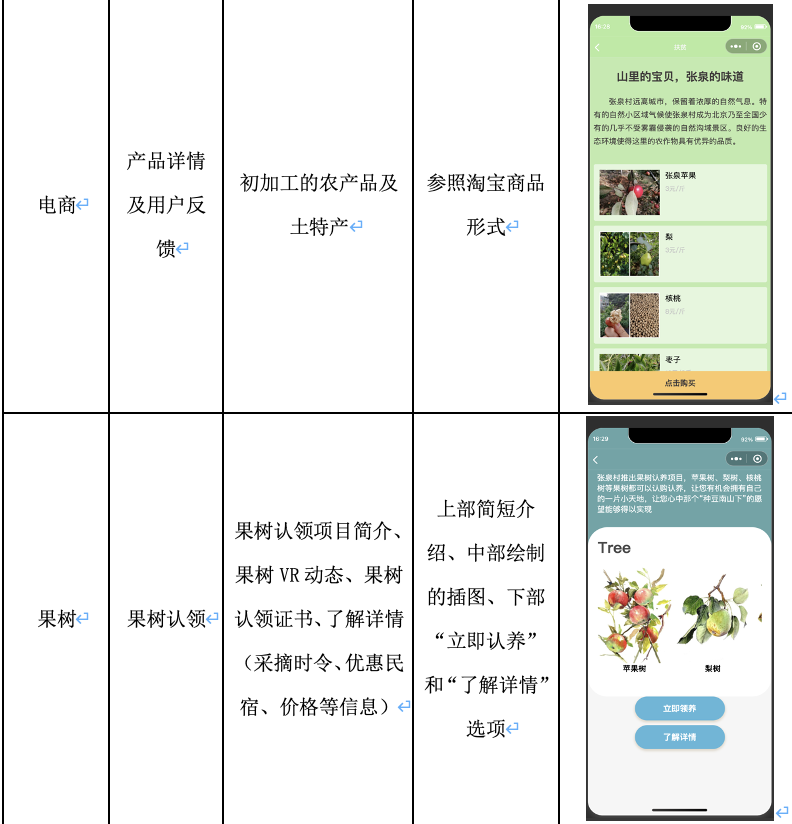

# Wechat-miniprogram-NongDouDou 农兜兜高效公益项目
北京农兜兜公益助农有限公司依据互联网技术，打造农兜兜微信小程序这一平台，为高校和乡村提供连接的桥梁。公司的主要服务范围包括：乡村产品直播带货、旅游项目开发、校园内体验店设置、常设活动策划、时令活动策划、志愿者招募与培训等，注重对乡村的经济、技术、教育等多方面的帮扶，拟在构建学生广泛参与的线上线下相结合的立体化助农模式。

